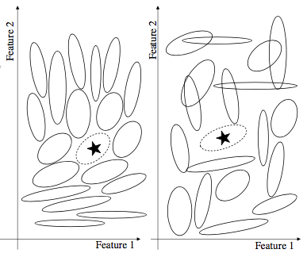

# Summary of Hidaka & Smith (2011)

The core idea is that similar categories will possess similar distributional structure. This proposal is entirely consistent with Ward and JK13, and also likely explains a lot of very general things about contrast.

In actuality, their model doesn't have a *goal* that categories should share distributional structure. It's really a side-effect: the model tries to represent each category such that the category distributions (assumed to be multivariate normal) capture their own exemplars, and are discriminable from one another (maximizing self-log-likelihood, minimizing cross-log-likelihood). The actual mathematics of the model are not simple, and I do not understand exactly how it works. Due to the way that space is filled with other categories, this tends to result in similarly represented categories. 

Their experiments (called "analyses") show that, in natural categories, featural distributions tend to be similar for categories that are similar ("Analysis 1"), and that this is predicted by the model ("Analysis 2").

Here's an example:

The star corresponds to a single example from a new category. Solid ellipses are known categories, and the dotted ellipse is the distribution for the starred category. As seen above, when the categories are "smoothly" distributed  (as observed in Analysis 1), the inferred distribution will share the structure of nearby categories. When the categories are not well packed, this is less true.

## Application to Generation

This is not an account of generation: it is assumed each category already exists, and the problem to be solved is in *representing* the categories. 

The problem of category generation, art least in our paradigm (this may be different for a paradigm like in Ward's work), differs considerably from the circumstances in which this model was developed. Critically, our spaces tend to be largely vacant (not like in the figure above). There is ample space for categories to differ, so that the structure of the generated category does not need to be constrained by existing categories. This has several effects:

1. As predicted by their model, people do appear to maximize distance, and they try to create coherent classes.
2. We do not have that much evidence for space-filling, or pure packing (though there are a few instances of this).
3. Instead, feature relevance for classification tends to be negatively related to feature variance (more relevance = less variance).

These observations have led us to the conclusion that people usually fill a category-sized space that allows for easy discrimination between categories.

My guess is that, due to the unconstrained space, their model will create very tightly packed categories as far from the Alphas as possible, as this satisfies the dual constraint (maximizing self-log-likelihood, minimizing cross-log-likelihood). But their model is actually really complex and we can't be sure without simulation.

## Some misc notes

- Many weird typos, and its in a weird journal. Very odd.
- Maybe we should ask people to generate categories with a starter example? This would help out the models that are lost without a start point. 
- Alternatively, you (Joe) had that idea to let people rate the quality of an entire beta category, or select between candidates.
